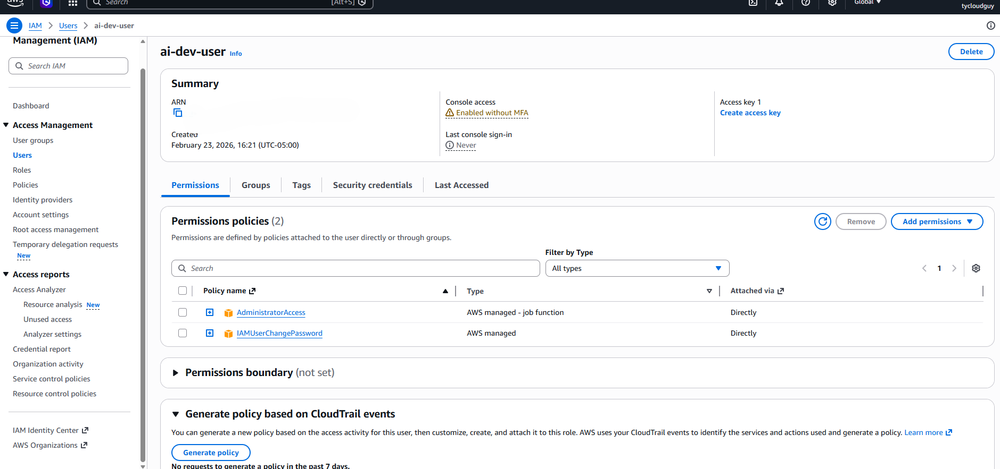
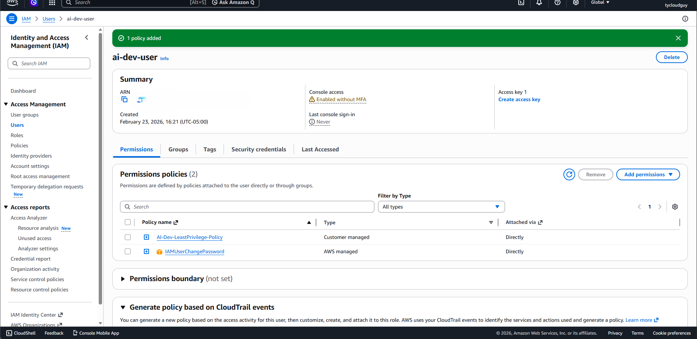

# Lab 01 – Implementing Least Privilege in AWS for AI Development

## Objective

Demonstrate implementation of the Principle of Least Privilege for an AI development IAM user in AWS.

---

## Risk Baseline

The IAM user was initially assigned:

- AdministratorAccess
- IAMUserChangePassword

This configuration violated least privilege principles and significantly expanded blast radius.

### Evidence – Overprivileged State

---

## Remediation

Removed AdministratorAccess and implemented a custom scoped policy:

- Limited S3 access to a specific bucket
- EC2 Describe permissions only
- No IAM creation or deletion privileges

### Evidence – Least Privilege Policy Applied

---

## Validation Results

- IAM creation capability: **Denied**
- S3 deletion capability: **Denied**
- S3 object upload: **Allowed**
- EC2 describe: **Allowed**

This confirms enforcement of scoped access controls.

---

## Governance Alignment

Aligned with:

- NIST SP 800-53 AC-6 (Least Privilege)
- NIST AI Risk Management Framework – Govern Function

This lab demonstrates reduction of excessive privilege and implementation of controlled access for AI development environments.
